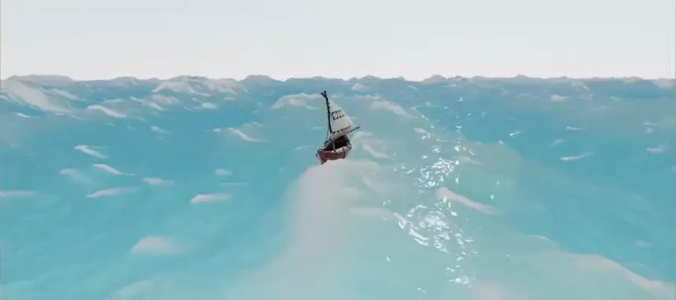

# FFT Ocean — browser water simulation

A real-time, Sea-of-Thieves-style ocean in the browser: a Tessendorf **FFT** wave
simulation (JONSWAP spectrum, multiple cascades) rendered with custom SSS-style
shading, foam, and a sailable boat with rigid-body buoyancy.

Built with [three.js](https://threejs.org) + WebGL2. The whole FFT runs on the GPU
via fragment-shader ping-pong (no compute shaders required).

## Demo

<p align="center">
  
</p>

## Run

```bash
npm install
npm run dev      # http://localhost:5173
npm run build    # production build into dist/
npm test         # unit tests (Vitest)
```

## Controls

- **WASD** — sail the boat
- **Mouse drag** — orbit camera, **scroll** — zoom
- Append **`?tune`** to the URL (e.g. `localhost:5173/?tune`) to open the live tuning panel.
- Debug views: `?debug=disp|slope|height` renders a raw FFT cascade texture.

## How it works

- `src/wave/OceanSim.js` — per-frame GPU pipeline: spectrum → time evolution → inverse FFT
  (`fft.js` + `butterfly.js`) → map assembly → foam accumulation, across cascades.
- `src/wave/spectrumPass.js`, `glsl/jonswap.glsl.js` — JONSWAP initial spectrum.
- `src/ocean/oceanMaterial.js` — surface shader: SSS scatter, fresnel, height-based color,
  foam, fog, boat hull displacement.
- `src/wave/WakeTrail.js` — world-space foam trail behind the boat.
- `src/wave/OceanSampler.js` — windowed GPU read-back for boat buoyancy queries.
- `src/objects/Boat.js` — rigid-body buoyancy (gravity + Archimedes force + righting torque).
- `src/config.js` — all tunable parameters.

Tunable values live in `config.js`; the `?tune` panel edits them live.

## Tests

`npm test` covers the CPU FFT reference, the butterfly/GPU-FFT texel layout, the
JONSWAP parameter math, the orbit-camera clamps, and the height sampler.

## Credits & licensing

This project depends on / was informed by third-party work — **review their licenses
before redistributing**:

- **three.js** and **lil-gui** (npm deps) — MIT.
- The FFT/JONSWAP approach follows Tessendorf's "Simulating Ocean Water" and was
  informed by [GarrettGunnell/Water](https://github.com/GarrettGunnell/Water); the
  GLSL here is an original WebGL2 implementation.
- **Boat model** — *not included* in this repo. The simulation runs without it (you
  just won't see a boat). To add one, drop a glTF model at
  `public/models/boat/Small_Sailing_Boat.gltf` (+ its `.bin` and `images/`).
- **`textures/waternormals.jpg`** — from the three.js examples.

The original code in `src/` is MIT-licensed — see [`LICENSE`](LICENSE).
